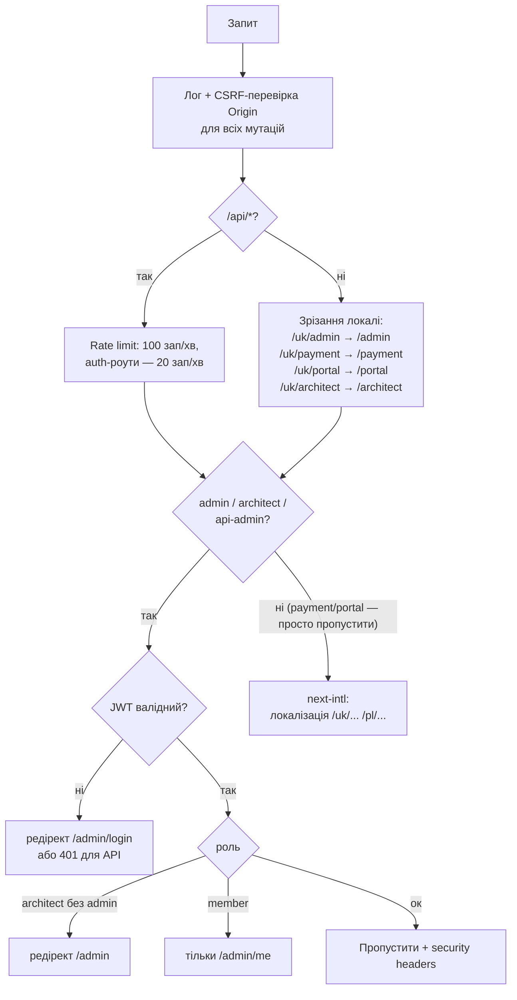

# 🧭 Методичка по проєкту KompasMigracji / KompasCRM

**Для:** Шеф Олександр
**Стан на:** 22 липня 2026 (звірено з живим кодом, не з застарілих README)
**Компанія:** DOMUS V Sp. z o.o. — юридичні послуги для мігрантів у Польщі та ЄС
**Продакшн:** Vercel, автодеплой при push у гілку `main`

---

## Зміст

1. [Що це за проєкт — за 60 секунд](#1-що-це-за-проєкт--за-60-секунд)
2. [Технологічний стек](#2-технологічний-стек)
3. [Швидкий старт і команди](#3-швидкий-старт-і-команди)
4. [Карта репозиторію](#4-карта-репозиторію)
5. [Маршрутизація та middleware — серце системи](#5-маршрутизація-та-middleware--серце-системи)
6. [Автентифікація, ролі та безпека](#6-автентифікація-ролі-та-безпека)
7. [Публічний сайт (5 мов)](#7-публічний-сайт-5-мов)
8. [Адмінка / CRM — два паралельні світи](#8-адмінка--crm--два-паралельні-світи)
9. [База даних — два клієнти, 31 міграція](#9-база-даних--два-клієнти-31-міграція)
10. [AI-підсистеми — чотири боти та LifeOS](#10-ai-підсистеми--чотири-боти-та-lifeos)
11. [Платежі — три провайдери](#11-платежі--три-провайдери)
12. [Месенджери та вебхуки](#12-месенджери-та-вебхуки)
13. [Cron-завдання](#13-cron-завдання)
14. [Портали: клієнт, учасник, NPS](#14-портали-клієнт-учасник-nps)
15. [Тестування та CI](#15-тестування-та-ci)
16. [Змінні середовища (ENV)](#16-змінні-середовища-env)
17. [Довідник бібліотек lib/](#17-довідник-бібліотек-lib)
18. [Рецепти: як робити типові задачі](#18-рецепти-як-робити-типові-задачі)
19. [Граблі, на які вже наступали](#19-граблі-на-які-вже-наступали)
20. [Де шукати додаткову документацію](#20-де-шукати-додаткову-документацію)

---

## 1. Що це за проєкт — за 60 секунд

**KompasCRM** (бренд для клієнтів — **Kompas Migracji**) — це моноліт на Next.js 14, який поєднує в одному застосунку **три дуже різні поверхні**:

| Поверхня | Де живе | Для кого | Що робить |
|---|---|---|---|
| **Публічний сайт** | `app/[locale]/*` | Клієнти-мігранти | Маркетинг, прайси, AI-чатбот, збір лідів. 5 мов |
| **CRM / Адмінка** | `app/admin/*` | Співробітники | 100+ модулів: ліди, угоди, справи, фінанси, HR, документи. RBAC за ролями |
| **Спецсистеми** | `app/architect`, `app/portal`, `app/member`, `app/payment` | Різні | LifeOS, клієнтський портал справ, кабінет учасника профспілки, оплати |

Плюс «під капотом»: **чотири окремі AI-боти** (публічний чатбот, Оракул для кандидатів, Оракул для роботодавців, Мілена-продажниця), оркестрація агентів **God/Primus**, три платіжні провайдери (Przelewy24, PayU, Stripe) і чотири месенджер-канали (WhatsApp, Telegram, Viber, Facebook).

**Ключова ідея для розуміння:** це не «один сайт», це три застосунки, склеєні одним `middleware.ts`. Майже кожна помилка новачка тут — це редагування не того дерева маршрутів або не того клієнта БД.

---

## 2. Технологічний стек

| Шар | Технологія | Примітка |
|---|---|---|
| Фреймворк | **Next.js 14** (App Router) | Мішаний TypeScript + JavaScript — це навмисно, див. §19 |
| UI | React 18, **Tailwind CSS 4**, framer-motion, lucide-react, recharts | Глас-морфізм адмінки — окремий `styles/glass.css` |
| Локалізація | **next-intl** | 5 локалей: `uk, pl, en, ru, rom`; дефолт — **`uk`** |
| БД | **Supabase (Postgres)** | Два клієнти доступу: raw `pg` та Supabase JS — НЕ взаємозамінні (§9) |
| Auth | JWT у httpOnly-cookie через `jose` + `bcryptjs` + TOTP 2FA (`lib/totp.ts`) | Cookie: `kompascrm_session` |
| AI | `ai` SDK + `@ai-sdk/google` (Gemini), `@anthropic-ai/sdk` (Claude), `@ai-sdk/openai` | Різні боти — різні моделі |
| Платежі | Przelewy24, PayU, **Stripe** | Пробуються по черзі (§11) |
| Пошта | SendGrid, nodemailer, imapflow (вхідна IMAP) | |
| Пакетний менеджер | **pnpm** | Тільки pnpm, не npm/yarn |
| Хостинг | **Vercel** | Крони — у `vercel.json` |

---

## 3. Швидкий старт і команди

```bash
pnpm install          # встановити залежності
pnpm dev              # дев-сервер → http://localhost:3000
pnpm build            # продакшн-збірка
pnpm lint             # ESLint
pnpm typecheck        # tsc --noEmit — перевірка типів
pnpm test:unit        # Jest (юніт-тести)
pnpm test:e2e         # Playwright (сам підніме dev-сервер)
pnpm seed:agents      # засіяти таблиці агентів God/Primus
```

Один тест:

```bash
pnpm test:unit -- lib/__tests__/milena-bot.test.ts
pnpm test:unit -- -t "назва тесту"
pnpm test:e2e -- e2e/agents.spec.ts
```

### ⚠️ Найважливіше правило збірки

**`pnpm build` НЕ ловить помилки типів і лінтера.** У `next.config.mjs` навмисно стоїть `ignoreDuringBuilds: true` і `ignoreBuildErrors: true`. Тому:

> **Зелена збірка ≠ робочий код.** Перед комітом завжди окремо: `pnpm lint` і `pnpm typecheck`.

Так само GitHub Actions CI (`.github/workflows/ci.yml`) — це **заглушка** (`echo "Checks passed"`), що існує лише щоб розблокувати Vercel. Зелена галочка в CI нічого не доводить.

---

## 4. Карта репозиторію

```
KompasMigracji/
├── app/
│   ├── [locale]/        ← публічний сайт (uk/pl/en/ru/rom)
│   ├── admin/           ← CRM: (panel) ~115 модулів + crm/ ~27 модулів + login, setup, agents
│   ├── api/             ← усі API-роути (admin, bot, chat, cron, god, orakul, payment…)
│   ├── architect/       ← LifeOS-панель (тільки роль admin)
│   ├── portal/          ← клієнтський портал справ (без логіна в CRM)
│   ├── member/          ← кабінет учасника профспілки
│   ├── payment/         ← сторінки оплат (без локалі!)
│   ├── nps/             ← сторінка NPS-опитування
│   └── architecture/    ← презентаційна сторінка архітектури
├── components/          ← публічні компоненти + admin/ + lifeos/ + member/ + payment/
├── lib/                 ← вся бізнес-логіка (див. §17)
├── db/migrations/       ← SQL-міграції 001–031
├── db/schema.sql        ← базова схема (старі kompas_* таблиці)
├── supabase/*.sql       ← схеми, застосовані напряму в Supabase
├── messages/            ← переклади {uk,pl,en,ru,rom}.json + admin/
├── e2e/                 ← Playwright-тести
├── __tests__/           ← Jest: integration/ + unit/
├── lib/__tests__/       ← Jest-тести бібліотек
├── docs/                ← інструкції (ця методичка, crm_manual_uk, website_manual_uk)
├── scripts/             ← утиліти; scripts/_archive/ — історичне сміття, НЕ приклад для наслідування
├── middleware.ts        ← маршрутизація + захист + rate limit (§5)
├── i18n.ts              ← конфіг локалей
└── vercel.json          ← security headers + крони
```

---

## 5. Маршрутизація та middleware — серце системи

Файл [`middleware.ts`](../middleware.ts) — це «диспетчер вокзалу». Кожен запит проходить крізь нього, і саме він вирішує, яке з трьох «дерев» відповідає.



**Правила, які треба знати напам'ять:**

- **Локальний префікс отримують ТІЛЬКИ сторінки в `app/[locale]/`.** `/admin`, `/payment`, `/portal`, `/architect` живуть без локалі; якщо хтось зайде на `/uk/admin` — middleware сам зробить редірект на `/admin`.
- Додаєш нову сторінку — **спочатку виріши**: вона публічна (→ `app/[locale]/...`, потрібні переклади у всіх 5 файлах `messages/`) чи внутрішня (→ `app/admin|portal|payment|architect/...`). Дерева не взаємозамінні.
- Публічні без логіна: `/admin/login`, `/admin/setup`, `/api/admin/auth/*`, `/api/admin/setup`.
- Middleware ставить security-заголовки (X-Frame-Options: DENY тощо); ще один шар заголовків, включно з CSP, задає `vercel.json`.

---

## 6. Автентифікація, ролі та безпека

### Як працює вхід

1. Користувач логіниться на `/admin/login` → `/api/admin/auth/*` перевіряє пароль (bcrypt) і, за наявності, TOTP-код 2FA (`lib/totp.ts`, свій модуль `/admin/2fa`).
2. Сервер підписує JWT секретом `JWT_SECRET` (через `jose`) і кладе його в **httpOnly-cookie `kompascrm_session`**.
3. Далі кожен запит перевіряють **два шари**:
   - `middleware.ts` — на рівні маршруту (пускати/не пускати взагалі);
   - усередині кожного API-роуту — `requireAuth(["admin", "moderator"])` з [`lib/auth.js`](../lib/auth.js). **Це обов'язковий патерн** для будь-якого нового роуту в `app/api/admin/**`.

### Ролі (7 штук)

`admin, moderator, manager, sales, lawyer, user, member`

| Роль | Що бачить |
|---|---|
| `admin` | Все, включно з `/architect` (LifeOS), налаштуваннями, фінансами |
| `moderator` | Майже все операційне, без фінансів/налаштувань |
| `manager` | Ліди, угоди, справи, комунікації, операції |
| `sales` | Ліди, угоди, скрипти продажів, колл-центр |
| `lawyer` | Виконавчі справи, суди, пошта |
| `user` | Мінімум (справи клієнтів, інструкція) |
| `member` | **Тільки** свій кабінет `/admin/me` — middleware жорстко редіректить |

### Дві незалежні системи прав

- **Доступ до API** — `requireAuth([...])` у кожному роуті.
- **Видимість пунктів меню** — [`lib/rbac.js`](../lib/rbac.js): масив `NAV` з полем `roles` у кожного пункту; `navFor(role)` фільтрує сайдбар. Меню згруповане: «Продажі та Клієнти», «Справи та Юриспруденція», «Комунікація та Маркетинг», «Фінанси та Аналітика», «Операції та Логістика», «Компанія та Розвиток», «ШІ та Інструменти», «Система та Налаштування».

**Сховати пункт меню ≠ закрити API.** Це два окремі місця; змінюючи права — онови обидва.

### Інші механізми безпеки

- **Rate limit** у middleware: 100 зап/хв на IP для API, 20 зап/хв для auth-роутів; публічний чат — окремо 10 зап/хв (`lib/rate-limit.ts`).
- **CSRF**: для всіх не-GET запитів звіряється `Origin` з `Host`.
- **CSP + HSTS + X-Frame-Options** — у `vercel.json`.
- **RODO/GDPR**: `lib/rodo.ts` — журнал згод і «право на забуття»; модуль `/admin/rodo` і міграція `024_security_rls_lockdown.sql` (RLS у Supabase).

---

## 7. Публічний сайт (5 мов)

### Локалізація

- Локалі: `uk` (дефолт), `pl`, `en`, `ru`, `rom` — задані в [`i18n.ts`](../i18n.ts). `localePrefix: "always"` — URL завжди з префіксом (`/uk/...`).
- Усі рядки — в `messages/{locale}.json`; компоненти читають через `useTranslations()`.
- **Додаєш рядок — додай у всі 5 файлів**, інакше на одній з мов сайт впаде або покаже ключ.

### Сторінки (`app/[locale]/`)

| Маршрут | Що це |
|---|---|
| `/` | Головна: Hero, ServicesGrid, HowItWorks, Pricing, Reviews, Team, FAQ, Blog, ContactForm |
| `/pricing`, `/plans` | Прайси та тарифні плани |
| `/karta` | Сторінка «Карта побиту» (нещодавно чинилась — TypeScript + локалі) |
| `/orakul` | Інтерфейс бота Оракул для кандидатів |
| `/book` | Запис на консультацію |
| `/manual` | Публічна інструкція |
| `/doctrine` | Доктрина/маніфест компанії |
| `/privacy`, `/regulamin` | Політика конфіденційності, регламент |

### Ключові компоненти (`components/`)

- **`ChatBot.tsx`** — публічний AI-чат (див. §10).
- **Лідогенерація**: `ContactForm`, `SituationQuiz` (квіз «ваша ситуація»), `ExitPopup` (спроба виходу), `ReturnVisitor` (повторний візит), `MobileCTABar`, `AIAssistantIntake`.
- **Довіра**: `Reviews`, `SocialProof`, `GuaranteeSection`, `Team`, `PortfolioCarousel`.
- **Оплата на сайті**: `PayModal`, `PaymentForm`, `P24PaymentSteps`.
- **Атмосфера**: `StarField`, `CosmicSpiral`, `SpotlightCard`, `ScrollProgress`.
- **Тема**: `ThemeSwitch`/`ThemeToggle` + `lib/ThemeContext.tsx` — темна/світла, зберігається в `localStorage` (ключ `theme`), перемикається атрибутом `data-theme` на `<html>`.

---

## 8. Адмінка / CRM — два паралельні світи

**Найпідступніший факт усього проєкту:** всередині `/admin` живуть **дві окремі, паралельні CRM-реалізації**, і обидві робочі:

| | `app/admin/(panel)/*` | `app/admin/crm/*` |
|---|---|---|
| Кількість модулів | ~115 папок | ~27 папок |
| API | `/api/admin/*` | `/api/admin/crm/*` |
| Приклад | `/admin/leads` | `/admin/crm/leads` |
| Походження | Масова генерація преміум-UI (див. `PROJECT.md`) | Пізніша, компактніша CRM |

`/admin/leads` і `/admin/crm/leads` — це **різні сторінки з різними API**. Перед редагуванням завжди перевір, у якому дереві живе модуль.

### ⚠️ Мокові модулі — головна пастка

Більшість модулів `(panel)` були згенеровані як **красивий каркас із фейковими даними**. У кожному — «AI-консоль агента» (`components/admin/AgentConsole.jsx`), яка друкує **симульовані** лог-рядки через `setInterval`. Це декорація, не реальний бекенд.

> **Правило:** якщо модуль виглядає повністю робочим — це ще нічого не значить. Перевір, чи існує API-роут, який він викликає, і чи торкається той роут реальних таблиць.

Реально працюючі напрямки (мають живі API та таблиці): ліди, угоди, задачі, справи, виконавчі провадження, пошта, шаблони документів, RODO, звіти, учасники профспілки, платежі/підписки, автоматизації.

### Групи модулів `(panel)` (за меню `lib/rbac.js`)

- **Продажі та Клієнти:** members, leads, deals, leads-finder, client-portal, loyalty, playbooks
- **Справи та Юриспруденція:** cases, enforcement, work-permits, litigation, contracts, e-signatures, doc-builder
- **Комунікація та Маркетинг:** emails, email-sequences, messengers, livechat, broadcasts, call-center, marketing, forms
- **Фінанси та Аналітика:** reports, accounting, e-invoicing (KSeF), expenses, subscriptions, currencies
- **Операції та Логістика:** appointments, booking, insurance (ZUS), housing, fleet, mailroom, hr-leave, service-catalog
- **Компанія та Розвиток:** academy, knowledge-base, gamification, partner-portal, referrals
- **ШІ та Інструменти:** copilot, ocr-scanner, workflows, gov-integration
- **Система:** `/architect` (LifeOS), manual (інструкція CRM), settings, integrations, 2fa

### Спільні UI-примітиви адмінки

`components/admin/ui.jsx` — `StatCard`, `ProgressBar`, `DataTable`, `EmptyState`, `SearchInput`, іконки `PATHS`. Також: `Shell.jsx`/`DualSidebarShell.jsx` (каркаси сторінок), `KanbanBoard`, `CommandPalette`, `GlobalSearch`, `NotificationCenter`, `ImportWizard`, `FileUpload`, `Timeline`, `LeadDetailsModal`, `AiCopilotSidebar`.

---

## 9. База даних — два клієнти, 31 міграція

### Два способи доступу — НЕ взаємозамінні

| | `lib/db.js` (raw pg) | `lib/supabase.ts` (Supabase JS) |
|---|---|---|
| Експортує | `q(text, params)`, `one(text, params)` | `supabase` (anon), `supabaseAdmin` (service key) |
| З'єднання | Новий `pg.Client` на кожен запит, без пулу | HTTP-клієнт Supabase |
| Хто використовує | Майже всі `/api/admin/*`, CRM-таблиці (`leads`, `tasks`, `deals`, `kompas_*`) | Агенти (`agents`, `agent_tasks`, `god_policies`), частина бот-лідів |
| Конфіг | Автовизначення: `PGHOST` → `DATABASE_URL` → `POSTGRES_URL` → `POSTGRES_HOST` → localhost | `NEXT_PUBLIC_SUPABASE_URL` + ключі |

Пишеш новий роут — подивись, у яких таблицях дані, і бери **той самий клієнт**, що й сусідні роути цього домену.

### Міграції (`db/migrations/`, зараз 001–031)

Нова міграція = наступний номер. Раннера в `package.json` немає — застосовуються вручну:

```bash
psql "$DATABASE_URL" -f db/migrations/0NN_нова.sql
# або scripts/apply-migration-file.ts
```

Хронологія (що за чим будували):

| №№ | Тема |
|---|---|
| 001–007 | Ліди (кошик, оплати), канбан працівників, задачі, автоматизації, growth |
| 008–009 | Поля Оракула, імміграційні справи клієнтів |
| 010–015 | Угоди, активності, файли, звіти, e-mail, виконавчі провадження |
| 016–018 | LifeOS: ядро, двигуни/логи, монетизація/CFO |
| 019–022 | Цифровий профіль профспілки, працевлаштування, легалізація, маркетплейс партнерів |
| 023–025 | Email-кампанії, **RLS-локдаун безпеки**, дзвінки CRM + налаштування |
| 026–028 | **Мілена**: sales-бот, стартові knowledge cards, RLS для Мілени |
| 029–031 | Веб-сесії Оракула, статуси `kompas_leads` (check + dropped) |

`db/schema.sql` — базова схема (старі `kompas_*` таблиці); `supabase/*.sql` — те, що застосовувалося напряму в Supabase.

---

## 10. AI-підсистеми — чотири боти та LifeOS

**П'ять незалежних систем.** Вони не діляться кодом і промптами — не плутати.

### 10.1. Публічний чатбот (сайт)

- **Роут:** `POST /api/chat`; **модель:** Gemini (`ai` SDK + `@ai-sdk/google`); **UI:** `components/ChatBot.tsx`.
- Має інструменти (tool-calling): пошук вакансій (`kompas_jobs_v2`), партнерів (`kompas_partners`), запис ліда — інструмент `record_lead` пише в `kompas_leads`.
- Rate limit: 10 запитів/хв/IP (`lib/rate-limit.ts`).
- Є підтримка локальної LLM: `USE_LOCAL_LLM` + `LOCAL_LLM_URL`/`LOCAL_LLM_MODEL`.

### 10.2. Оракул — кандидати

- **Роут:** `POST /api/orakul/chat`; **код:** `lib/orakul-bot.ts` + `lib/orakul-prompt.ts`; **UI:** сторінка `/[locale]/orakul`.
- Окрема персона й промпт (не плутати з чатботом сайту). Веде кандидатів на працевлаштування, трекає веб-сесії (міграція 029).
- Cron `/api/cron/orakul-abandoned` (щодня 06:00) — «підбирає» покинуті діалоги.

### 10.3. Оракул — роботодавці (EWU-рекрутинг)

- **Код:** `lib/orakul-employer.ts`. Збирає структуровану анкету роботодавця (компанія, NIP, позиції, ставки, житло, сертифікати зварювальників тощо).
- Архітектурний принцип: критичні правила живуть **у детермінованому коді, а не в промпті** — витяг JSON, рендер зібраних даних і тригери ескалації (кількість людей / ставка) продубльовані кодом як «бекстоп» до LLM.
- Нотифікації: `EMPLOYER_LEAD_NOTIFY_EMAIL`.

### 10.4. Мілена — бот продажів (месенджери)

- **Код:** `lib/milena-bot.ts` — **детермінований рушій**: інтенти, обов'язкові поля, мета-флоу вирішують «ЩО робити». Claude (`ANTHROPIC_API_KEY`) викликається лише в `app/api/bot/milena/message/route.ts` — «ЯК сказати».
- **Передача людині:** `lib/milena-handoff.ts` — ескалація на живого менеджера.
- **Дані:** міграції 026 (таблиці), 027 (стартові knowledge cards), 028 (RLS).
- Тести: `lib/__tests__/milena-bot.test.ts`.

### 10.5. God / Primus — оркестрація агентів

- `POST /api/god/command` → диспетчеризація в `POST /api/agents/primus/dispatch` → задачі в Supabase-таблицях `agents` / `agent_tasks` (`lib/agents.ts`, `lib/god.ts`, політики — `god_policies`).
- Монітор: `GET /api/agents/monitor/cron` — сканує heartbeat'и, шле алерти (`lib/notify.ts`, `lib/monitor.ts`).
- UI: `/admin/agents` (`AgentsDashboard` → `GodCard` + `AgentCard[]`, SWR-пулінг кожні 10 с).
- ⚠️ Авторизація тут — **хардкод e-mail** (`iphoenixgsm@gmail.com`), не ролі. Це відомий борг.

### 10.6. LifeOS (окрема система!)

- `lib/lifeos/` — `alexDigital.ts`, `fateEngine.ts`, `soulEngine.ts`; UI — `/architect/*` (тільки роль `admin`); cron — `/api/cron/lifeos` щодня опівночі.
- **Не плутати з God/Primus** — спільна лише тема «автономних агентів», код незалежний.

---

## 11. Платежі — три провайдери

`/api/payment` пробує провайдерів **по черзі**, беручи перший, для якого налаштовані env-змінні:

```
Przelewy24  →  PayU  →  Stripe  →  внутрішній мок (/payment/mock/[sessionId])
```

| Провайдер | Клієнт | Вебхук | Особливості |
|---|---|---|---|
| **Przelewy24** | `lib/przelewy24.ts` | `/api/payment-notify` (IPN) | Підпис SHA-384; sandbox через `P24_SANDBOX` |
| **PayU** | `lib/payu.ts` | `/api/payu/notify` | |
| **Stripe** | `lib/stripe.ts` | `/api/stripe/webhook` | + `/api/stripe/checkout-architecture` |

Сторінки оплат — `app/payment/*` (**без** локального префіксу). Після успішної оплати: `lib/commissions.ts` рахує комісію агента за правилами `kompas_commission_rules`, `lib/invoices.ts` — інвойси.

> Провайдери **не** уніфіковані спільним інтерфейсом. Перш ніж чіпати платіжний код — з'ясуй, до якої пари «lib + вебхук» він належить.

---

## 12. Месенджери та вебхуки

Усе вхідне — під `app/api/bot/*`:

| Канал | Клієнт | Вебхук |
|---|---|---|
| Telegram | `lib/telegram.ts` | `/api/bot/webhook` (+ `/api/bot/setup` для реєстрації, секрети `TELEGRAM_WEBHOOK_SECRET` / `TELEGRAM_SETUP_SECRET`) |
| WhatsApp | `lib/whatsapp.ts` | `/api/bot/whatsapp` (`WHATSAPP_TOKEN`, `WHATSAPP_PHONE_ID`, `WHATSAPP_VERIFY_TOKEN`) |
| Viber | — | `/api/bot/viber-webhook` |
| Facebook | — | `/api/bot/fb-webhook` |
| Мілена | §10.4 | `/api/bot/milena/message` |
| Вихідні | — | `/api/bot/outbound` (закритий авторизацією після security-фіксу) |

Адмін-алерти летять у Telegram (`TELEGRAM_ADMIN_CHAT_ID` — найуживаніша env-змінна проєкту) та на пошту через `lib/notify.ts` / `lib/email.ts` (SendGrid; вхідна пошта — imapflow, HTML вхідних листів санітизується — був окремий security-фікс).

---

## 13. Cron-завдання

Роутів у `app/api/cron/` — **дев'ять**, але в `vercel.json` зареєстровано **лише два**:

| Роут | У vercel.json? | Розклад | Що робить |
|---|---|---|---|
| `/api/cron/lifeos` | ✅ | `0 0 * * *` | Щоденний цикл LifeOS |
| `/api/cron/orakul-abandoned` | ✅ | `0 6 * * *` | Покинуті діалоги Оракула |
| `/api/cron/appointment-reminders` | ❌ | — | Нагадування про записи |
| `/api/cron/daily-snapshot` | ❌ | — | Щоденний зріз метрик |
| `/api/cron/dues-reminders` | ❌ | — | Нагадування про внески |
| `/api/cron/lead-followup` | ❌ | — | Фолоу-ап лідів |
| `/api/cron/nps-survey` | ❌ | — | Розсилка NPS |
| `/api/cron/subscription-renewal` | ❌ | — | Продовження підписок |
| `/api/cron/weekly-digest` | ❌ | — | Тижневий дайджест |

> **Висновок для Шефа:** сім кронів написані, але **ніколи не запускаються самі** — їх треба або додати у `vercel.json`, або смикати зовнішнім планувальником. Усі захищені секретом `CRON_SECRET`.
> Окремо живе монітор агентів: `GET /api/agents/monitor/cron`.

---

## 14. Портали: клієнт, учасник, NPS

| Дерево | Хто заходить | Що там |
|---|---|---|
| `app/portal/` (`/portal/case/...`, `/portal/project/...`) | Клієнт за посиланням | Статус своєї справи/проєкту без доступу до CRM |
| `app/member/` (`/member/jobs`, `legal`, `marketplace`, `profile`, `rewards`) | Учасник профспілки | Вакансії, юрдопомога, маркетплейс, профіль, бонуси |
| `app/admin/me` | Роль `member` у CRM | Особистий кабінет (middleware пускає member'а ТІЛЬКИ сюди) |
| `app/nps/` | Клієнт з розсилки | Оцінка NPS (`/api/nps`) |
| `app/architecture/` | Публічно | Презентаційна сторінка архітектури (є Stripe-checkout `/api/stripe/checkout-architecture`) |

---

## 15. Тестування та CI

### Юніт-тести (Jest)

- Живуть **тільки** в `__tests__/` та `lib/__tests__/` — конфіг ловить шаблон `**/__tests__/**/*.test.{ts,tsx}`. Тест поза цими папками просто не запуститься.
- Покрито ядро: `agents`, `god`, `monitor`, `notify`, `milena-bot`, `orakul-employer`, `chat-route`, `payment-route`, `rate-limit`, `routes.integration`.

### E2E (Playwright, `e2e/*.spec.ts`)

`agents.spec.ts`, `main-site-verify.spec.ts`, `orakul-verify.spec.ts`, `orakul-candidate-and-metadata.spec.ts`. Запуск `pnpm test:e2e` сам піднімає dev-сервер.

### Чого тести НЕ гарантують

- CI — заглушка (§3), збірка не перевіряє типи. Реальна перевірка перед релізом: `pnpm lint && pnpm typecheck && pnpm test:unit`, для критичних змін + e2e.

---

## 16. Змінні середовища (ENV)

Згруповано за призначенням (найуживаніші — жирним):

| Група | Змінні |
|---|---|
| Ядро | **`JWT_SECRET`** (без нього прод не стартує), **`NEXT_PUBLIC_APP_URL`**, `NODE_ENV` |
| БД (пріоритет зліва направо) | `PGHOST`/`PGUSER`/`PGPASSWORD`/`PGDATABASE`/`PGPORT`/`PGSSL` → `DATABASE_URL` → `POSTGRES_URL` → `POSTGRES_HOST`… |
| Supabase | `NEXT_PUBLIC_SUPABASE_URL`, `NEXT_PUBLIC_SUPABASE_ANON_KEY`, `SUPABASE_SERVICE_ROLE_KEY` (варіанти: `SUPABASE_SERVICE_ROLE`, `SUPABASE_SERVICE_KEY`) |
| AI | `GEMINI_API_KEY` (чатбот/Оракул), `ANTHROPIC_API_KEY` (Мілена), `USE_LOCAL_LLM` + `LOCAL_LLM_URL` + `LOCAL_LLM_MODEL` |
| Przelewy24 | `P24_MERCHANT_ID`, `P24_CRC`, `P24_API_KEY`, `P24_SANDBOX` |
| PayU / Stripe | `PAYU_*`, `PAYU_SANDBOX`; `STRIPE_SECRET_KEY`, `STRIPE_WEBHOOK_SECRET` |
| Telegram | **`TELEGRAM_ADMIN_CHAT_ID`**, `TELEGRAM_BOT_TOKEN`, `TELEGRAM_BOT_TOKENS`, `TELEGRAM_WEBHOOK_SECRET`, `TELEGRAM_SETUP_SECRET`, `ADMIN_TELEGRAM_CHAT_ID` |
| WhatsApp | `WHATSAPP_TOKEN`, `WHATSAPP_PHONE_ID`, `WHATSAPP_VERIFY_TOKEN` |
| Пошта | `SENDGRID_API_KEY`, `RESEND_API_KEY` |
| Крони | **`CRON_SECRET`** |
| Інше | `EMPLOYER_LEAD_NOTIFY_EMAIL` |

### ⚠️ Патерн `cleanEnv` — обов'язковий

Env-змінні, вставлені з Windows/PowerShell, часто тягнуть за собою невидимий BOM (`U+FEFF`) та `\r`. Тому `middleware.ts`, `lib/db.js`, `lib/auth.js` читають env через хелпер `cleanEnv`/`clean`, який це зрізає. **Читаєш нову «сиру» env-змінну в серверному коді — використовуй той самий хелпер**, не вигадуй свій.

---

## 17. Довідник бібліотек lib/

| Файл | Призначення |
|---|---|
| `auth.js` | `requireAuth(roles)` — перевірка JWT у API-роутах |
| `rbac.js` | Масив `NAV` (меню) + `navFor(role)` |
| `db.js` | `q()`, `one()` — raw Postgres |
| `supabase.ts` | Клієнти `supabase` / `supabaseAdmin` |
| `rate-limit.ts` | Ліміт запитів (чат) |
| `totp.ts` | TOTP 2FA (генерація/перевірка кодів) |
| `rodo.ts` | GDPR: журнал згод, право на забуття |
| `email.ts`, `notify.ts` | Вихідна пошта (SendGrid), алерти адмінам |
| `telegram.ts`, `whatsapp.ts` | Клієнти месенджерів |
| `przelewy24.ts`, `payu.ts`, `stripe.ts` | Платіжні клієнти |
| `invoices.ts`, `commissions.ts` | Інвойси; комісії агентів після оплат |
| `orakul-bot.ts`, `orakul-prompt.ts` | Оракул-кандидати: логіка + промпт |
| `orakul-employer.ts` | Оракул-роботодавці (EWU): JSON-екстракція, ескалації |
| `milena-bot.ts`, `milena-handoff.ts` | Мілена: детермінований рушій + передача людині |
| `agents.ts`, `god.ts`, `monitor.ts` | God/Primus: агенти, політики, heartbeat-монітор |
| `lifeos/*` | LifeOS: alexDigital, fateEngine, soulEngine |
| `task-from-lead.ts` | Автостворення задачі з ліда |
| `template-render.js` | Рендер шаблонів документів |
| `doctrine.ts` | Контент сторінки «Доктрина» |
| `navigation.ts` | Локалізована навігація публічного сайту |
| `ThemeContext.tsx`, `useCookieConsent.ts` | Тема; згода на cookies |

---

## 18. Рецепти: як робити типові задачі

### Додати публічну сторінку
1. Створи `app/[locale]/нова-сторінка/page.tsx` (**TypeScript** — публічне дерево на TS).
2. Усі тексти — через `useTranslations()`; додай ключі в **усі 5** файлів `messages/*.json`.
3. Перевір на `/uk/нова-сторінка` і ще хоча б одній локалі.

### Додати модуль в адмінку
1. Виріши дерево: `(panel)` чи `crm` (див. §8) — і роби в стилі сусідів (**JS/JSX** в адмінці).
2. Сторінка: `app/admin/(panel)/модуль/page.jsx`; API: `app/api/admin/модуль/route.js`.
3. У роуті **першим ділом** `requireAuth([...])` з `lib/auth.js`.
4. Пункт меню — в `NAV` у `lib/rbac.js` з правильними `roles`.
5. Дані — через `q()`/`one()` з `lib/db.js` (якщо це CRM-таблиці).

### Додати міграцію БД
1. Файл `db/migrations/032_назва.sql` (наступний номер!).
2. Застосуй: `psql "$DATABASE_URL" -f db/migrations/032_назва.sql`.
3. Для Supabase-таблиць не забудь RLS (дивись зразки 024, 028).

### Перед комітом — завжди
```bash
pnpm lint && pnpm typecheck && pnpm test:unit
```
Push у `main` = деплой на прод. Без винятків.

---

## 19. Граблі, на які вже наступали

1. **Зелений build ≠ здоровий код** — типи й лінт вимкнені у збірці (§3).
2. **CI — заглушка.** Галочка на GitHub нічого не перевіряє.
3. **Два дерева CRM** — переконайся, що редагуєш правильне (§8).
4. **Мокові модулі** — красивий UI ≠ робочий бекенд; «телеметрія» AI-консолей — симуляція.
5. **Два клієнти БД** — `pg` та Supabase не взаємозамінні (§9).
6. **JS vs TS — навмисно.** Адмінка на JS, публічний сайт на TS. Не «виправляй» розширення, підлаштовуйся під файл, який редагуєш.
7. **BOM в env** — читай env лише через `cleanEnv` (§16).
8. **README.md застарілий** (4 локалі замість 5, немає Stripe/PayU/LifeOS/Оракула). Джерело правди — `CLAUDE.md`, ця методичка і сам код. У `CLAUDE.md` теж є дрібні розбіжності: дефолтна локаль насправді `uk` (не `pl`), міграцій 31 (не 22).
9. **God/Primus авторизується хардкод-email'ом**, не ролями — відомий борг.
10. **7 із 9 кронів не заплановані** у `vercel.json` (§13).
11. **`scripts/_archive/`** — одноразові історичні скрипти, не зразок для нових. **`.agents/`** — лог минулих агент-сесій, не документація. **`docs/agent-learnings.md`** — append-only, руками історію не правити.
12. **Локаль і адмінка несумісні:** `/uk/admin` не існує — middleware редіректить, але посилання в коді завжди пиши без локалі для admin/payment/portal/architect.

---

## 20. Де шукати додаткову документацію

| Документ | Що всередині |
|---|---|
| `CLAUDE.md` | Технічний гід для AI-асистентів (найактуальніший огляд архітектури) |
| `docs/crm_manual_uk.md` | Інструкція користувача CRM (для співробітників) |
| `docs/website_manual_uk.md` | Інструкція користувача сайту (для клієнтів) |
| `PROJECT.md`, `ORIGINAL_REQUEST.md` | Історія генерації 120-модульної адмінки |
| `docs/agent-learnings.md` | Журнал висновків автоматичних аудитів |
| `db/schema.sql`, `db/migrations/`, `supabase/*.sql` | Повна історія схеми даних |

---

*Методичку складено автоматично на основі аудиту живого коду репозиторію KompasMigracji станом на 22.07.2026. При розбіжностях між цим документом і кодом — правий код; онови методичку.*
